# ADHD_Control_Markdown
Daniel Newman  
12 Jan 2016  


#First Test the Group x Hemifield effect on RTs:


```
## Data: data2
## Models:
## RT_random_intercepts_only: log(RT) ~ 1 + (1 | ID) + (1 | ITI) + (1 | Hemifield) + (1 | Trial)
## RT_Group: log(RT) ~ (1 | ID) + (1 | ITI) + (1 | Hemifield) + (1 | Trial) + 
## RT_Group:     Group
## RT_Hemifield: log(RT) ~ (1 | ID) + (1 | ITI) + (1 | Hemifield) + (1 | Trial) + 
## RT_Hemifield:     Group + Hemifield
## RT_HemifieldbyGroup: log(RT) ~ (1 | ID) + (1 | ITI) + (1 | Hemifield) + (1 | Trial) + 
## RT_HemifieldbyGroup:     Group + Hemifield + Group:Hemifield
##                           Df    AIC    BIC  logLik deviance  Chisq Chi Df
## RT_random_intercepts_only  6 1380.3 1422.9 -684.17   1368.3              
## RT_Group                   7 1377.4 1427.1 -681.71   1363.4 4.9225      1
## RT_Hemifield               8 1377.1 1433.9 -680.54   1361.1 2.3309      1
## RT_HemifieldbyGroup        9 1371.8 1435.7 -676.92   1353.8 7.2364      1
##                           Pr(>Chisq)   
## RT_random_intercepts_only              
## RT_Group                    0.026508 * 
## RT_Hemifield                0.126830   
## RT_HemifieldbyGroup         0.007144 **
## ---
## Signif. codes:  0 '***' 0.001 '**' 0.01 '*' 0.05 '.' 0.1 ' ' 1
```


**So controls have significantly faster RTs overall, and there is a significant Group x Hemifield effect**

##Break down the significant Group x Hemifield effect on RT

```
## 
## 	 Simultaneous Tests for General Linear Hypotheses
## 
## Fit: lmer(formula = log(RT) ~ Hemifield + (1 | ID) + (1 | ITI) + (1 | 
##     Hemifield) + (1 | Trial), data = data2[data2$Group == "ADHD", 
##     ], REML = FALSE, na.action = na.omit)
## 
## Linear Hypotheses:
##                      Estimate Std. Error z value Pr(>|z|)    
## (Intercept) == 0     6.701989   0.045390 147.654   <1e-10 ***
## HemifieldRight == 0 -0.005204   0.009074  -0.574    0.811    
## ---
## Signif. codes:  0 '***' 0.001 '**' 0.01 '*' 0.05 '.' 0.1 ' ' 1
## (Adjusted p values reported -- single-step method)
```

```
## 
## 	 Simultaneous Tests for General Linear Hypotheses
## 
## Fit: lmer(formula = log(RT) ~ Hemifield + (1 | ID) + (1 | ITI) + (1 | 
##     Hemifield) + (1 | Trial), data = data2[data2$Group == "Control", 
##     ], REML = FALSE, na.action = na.omit)
## 
## Linear Hypotheses:
##                     Estimate Std. Error z value Pr(>|z|)    
## (Intercept) == 0     6.58749    0.05348 123.173  < 1e-10 ***
## HemifieldRight == 0  0.02298    0.00700   3.284  0.00205 ** 
## ---
## Signif. codes:  0 '***' 0.001 '**' 0.01 '*' 0.05 '.' 0.1 ' ' 1
## (Adjusted p values reported -- single-step method)
```

###So Controls have significant pseudoneglect (i.e. faster RTs to left hemifield targets), and ADHD do not

**Lets plot this:**


```
## Loading required package: effects
## 
## Attaching package: 'effects'
## 
## The following object is masked from 'package:car':
## 
##     Prestige
```

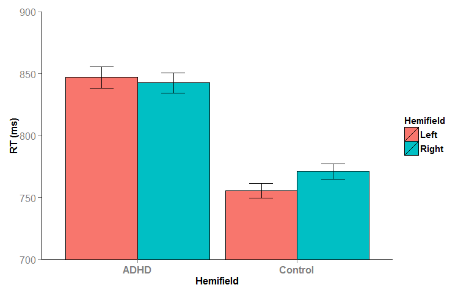 


#Single trial N2 Amplitude 

###N2c/i measurement window (100ms) was centred on peak amplitude of each INDIVIDUAL PARTICIANT's AVERAGE N2c/i waveforms:


```
## Data: DF
## Models:
## N2_random_intercepts_only: N2 ~ 1 + (1 | ID/Hemisphere) + (1 | ITI) + (1 | Hemifield) + 
## N2_random_intercepts_only:     (1 | Trial)
## N2_Group: N2 ~ (1 | ID/Hemisphere) + (1 | ITI) + (1 | Hemifield) + (1 | 
## N2_Group:     Trial) + Group
## N2_Hemifield: N2 ~ (1 | ID/Hemisphere) + (1 | ITI) + (1 | Hemifield) + (1 | 
## N2_Hemifield:     Trial) + Group + Hemifield
## N2_Hemisphere: N2 ~ (1 | ID/Hemisphere) + (1 | ITI) + (1 | Hemifield) + (1 | 
## N2_Hemisphere:     Trial) + Group + Hemifield + Hemisphere
## N2_HemifieldbyGroup: N2 ~ (1 | ID/Hemisphere) + (1 | ITI) + (1 | Hemifield) + (1 | 
## N2_HemifieldbyGroup:     Trial) + Group + Hemifield + Hemisphere + Group:Hemifield
## N2_HemispherebyGroup: N2 ~ (1 | ID/Hemisphere) + (1 | ITI) + (1 | Hemifield) + (1 | 
## N2_HemispherebyGroup:     Trial) + Group + Hemifield + Hemisphere + Group:Hemifield + 
## N2_HemispherebyGroup:     Group:Hemisphere
## N2_HemifieldbyHemisphere: N2 ~ (1 | ID/Hemisphere) + (1 | ITI) + (1 | Hemifield) + (1 | 
## N2_HemifieldbyHemisphere:     Trial) + Group + Hemifield + Hemisphere + Group:Hemifield + 
## N2_HemifieldbyHemisphere:     Group:Hemisphere + Hemifield:Hemisphere
## N2_HemifieldbyGroupbyHemisphere: N2 ~ (1 | ID/Hemisphere) + (1 | ITI) + (1 | Hemifield) + (1 | 
## N2_HemifieldbyGroupbyHemisphere:     Trial) + Group + Hemifield + Hemisphere + Group:Hemifield + 
## N2_HemifieldbyGroupbyHemisphere:     Group:Hemisphere + Hemifield:Hemisphere + Group:Hemifield:Hemisphere
##                                 Df    AIC    BIC logLik deviance   Chisq
## N2_random_intercepts_only        7 125568 125623 -62777   125554        
## N2_Group                         8 125567 125628 -62775   125551  3.9200
## N2_Hemifield                     9 125568 125638 -62775   125550  0.2554
## N2_Hemisphere                   10 125554 125632 -62767   125534 15.8399
## N2_HemifieldbyGroup             11 125556 125641 -62767   125534  0.8279
## N2_HemispherebyGroup            12 125554 125647 -62765   125530  3.2029
## N2_HemifieldbyHemisphere        13 125551 125652 -62763   125525  5.3044
## N2_HemifieldbyGroupbyHemisphere 14 125546 125655 -62759   125518  6.9298
##                                 Chi Df Pr(>Chisq)    
## N2_random_intercepts_only                            
## N2_Group                             1   0.047715 *  
## N2_Hemifield                         1   0.613319    
## N2_Hemisphere                        1  6.893e-05 ***
## N2_HemifieldbyGroup                  1   0.362883    
## N2_HemispherebyGroup                 1   0.073507 .  
## N2_HemifieldbyHemisphere             1   0.021271 *  
## N2_HemifieldbyGroupbyHemisphere      1   0.008477 ** 
## ---
## Signif. codes:  0 '***' 0.001 '**' 0.01 '*' 0.05 '.' 0.1 ' ' 1
```

###So there is a significant Group x Hemifield x Hemisphere

**Plot it:**

**First Plot the marginal N2 means and 95% CIs predicted by the model:**

 

**Now plot the actual N2 data (note these error bars are std. error):**

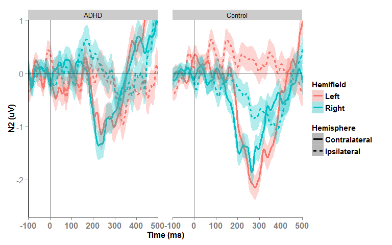 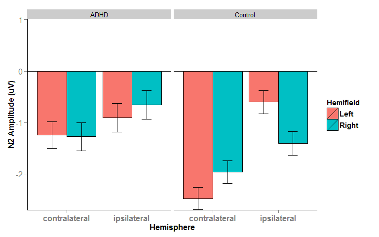 

###Break down the significant Group x Hemifield x Hemisphere effect. Test simple effect of 'Group' inside each combination of hemifield x Hemisphere 


```
## 
## 	 Simultaneous Tests for General Linear Hypotheses
## 
## Fit: lmer(formula = N2 ~ Group + (1 | ID) + (1 | ITI) + (1 | Trial), 
##     data = DF[DF$Hemifield == "Left" & DF$Hemisphere == "contralateral", 
##         ], REML = FALSE, na.action = na.omit)
## 
## Linear Hypotheses:
##                   Estimate Std. Error z value Pr(>|z|)   
## (Intercept) == 0   -1.2433     0.4254  -2.923  0.00611 **
## GroupControl == 0  -1.2566     0.5540  -2.268  0.03872 * 
## ---
## Signif. codes:  0 '***' 0.001 '**' 0.01 '*' 0.05 '.' 0.1 ' ' 1
## (Adjusted p values reported -- single-step method)
```

```
## 
## 	 Simultaneous Tests for General Linear Hypotheses
## 
## Fit: lmer(formula = N2 ~ Group + (1 | ID) + (1 | ITI) + (1 | Trial), 
##     data = DF[DF$Hemifield == "Left" & DF$Hemisphere == "ipsilateral", 
##         ], REML = FALSE, na.action = na.omit)
## 
## Linear Hypotheses:
##                   Estimate Std. Error z value Pr(>|z|)   
## (Intercept) == 0   -0.9142     0.3120  -2.930  0.00593 **
## GroupControl == 0   0.2994     0.4037   0.742  0.62043   
## ---
## Signif. codes:  0 '***' 0.001 '**' 0.01 '*' 0.05 '.' 0.1 ' ' 1
## (Adjusted p values reported -- single-step method)
```

```
## 
## 	 Simultaneous Tests for General Linear Hypotheses
## 
## Fit: lmer(formula = N2 ~ Group + (1 | ID) + (1 | ITI) + (1 | Trial), 
##     data = DF[DF$Hemifield == "Right" & DF$Hemisphere == "contralateral", 
##         ], REML = FALSE, na.action = na.omit)
## 
## Linear Hypotheses:
##                   Estimate Std. Error z value Pr(>|z|)   
## (Intercept) == 0   -1.2912     0.4364  -2.959  0.00586 **
## GroupControl == 0  -0.7255     0.4390  -1.652  0.16696   
## ---
## Signif. codes:  0 '***' 0.001 '**' 0.01 '*' 0.05 '.' 0.1 ' ' 1
## (Adjusted p values reported -- single-step method)
```

```
## 
## 	 Simultaneous Tests for General Linear Hypotheses
## 
## Fit: lmer(formula = N2 ~ Group + (1 | ID) + (1 | ITI) + (1 | Trial), 
##     data = DF[DF$Hemifield == "Right" & DF$Hemisphere == "ipsilateral", 
##         ], REML = FALSE, na.action = na.omit)
## 
## Linear Hypotheses:
##                   Estimate Std. Error z value Pr(>|z|)  
## (Intercept) == 0   -0.6687     0.3072  -2.177   0.0499 *
## GroupControl == 0  -0.7443     0.3684  -2.020   0.0722 .
## ---
## Signif. codes:  0 '***' 0.001 '**' 0.01 '*' 0.05 '.' 0.1 ' ' 1
## (Adjusted p values reported -- single-step method)
```

###So the interaction is driven by a significantly larger left target N2c in Controls than in ADHD


#CPP onset 

###CPP onset was measured on a participant level (rather than on a single trial level) using the same method as Ger's Current Biology paper


```
## Data: CPPonset_participant_level_long
## Models:
## CPPonset_random_intercepts_only: CPPonset ~ 1 + (1 | Group/ID) + (1 | Hemifield)
## CPPonset_Hemifield: CPPonset ~ (1 | Group/ID) + (1 | Hemifield) + Hemifield
## CPPonset_Group: CPPonset ~ (1 | Group/ID) + (1 | Hemifield) + Hemifield + Group
## CPPonset_Hemifield_By_Group: CPPonset ~ (1 | Group/ID) + (1 | Hemifield) + Hemifield + Group + 
## CPPonset_Hemifield_By_Group:     Hemifield:Group
##                                 Df    AIC    BIC  logLik deviance  Chisq
## CPPonset_random_intercepts_only  5 1365.9 1379.3 -677.95   1355.9       
## CPPonset_Hemifield               6 1366.8 1382.9 -677.39   1354.8 1.1361
## CPPonset_Group                   7 1368.0 1386.8 -677.02   1354.0 0.7244
## CPPonset_Hemifield_By_Group      8 1365.5 1386.9 -674.72   1349.5 4.5983
##                                 Chi Df Pr(>Chisq)  
## CPPonset_random_intercepts_only                    
## CPPonset_Hemifield                   1     0.2865  
## CPPonset_Group                       1     0.3947  
## CPPonset_Hemifield_By_Group          1     0.0320 *
## ---
## Signif. codes:  0 '***' 0.001 '**' 0.01 '*' 0.05 '.' 0.1 ' ' 1
```

###So there is a significant Group x Hemifield effect for CPP onset

**Plot it:**

**First Plot the marginal CPPonset means and 95% CIs predicted by the model:**


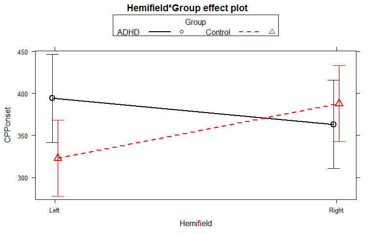 

**Now plot the actual CPPonset data:**

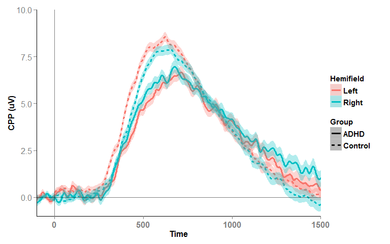 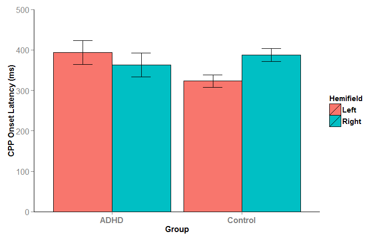 


###Break down the significant Group x Hemifield CPPonset effect. Test simple effect of 'hemifield' inside each Group


```
## 
## 	 Simultaneous Tests for General Linear Hypotheses
## 
## Fit: lmer(formula = CPPonset ~ Hemifield + (1 | ID) + (1 | Hemifield), 
##     data = CPPonset_participant_level_long[CPPonset_participant_level_long$Group == 
##         "ADHD", ], REML = FALSE, na.action = na.omit)
## 
## Linear Hypotheses:
##                     Estimate Std. Error z value Pr(>|z|)    
## (Intercept) == 0      394.09      30.94   12.74   <1e-10 ***
## HemifieldRight == 0   -30.78      41.06   -0.75    0.644    
## ---
## Signif. codes:  0 '***' 0.001 '**' 0.01 '*' 0.05 '.' 0.1 ' ' 1
## (Adjusted p values reported -- single-step method)
```

```
## 
## 	 Simultaneous Tests for General Linear Hypotheses
## 
## Fit: lmer(formula = CPPonset ~ Hemifield + (1 | ID) + (1 | Hemifield), 
##     data = CPPonset_participant_level_long[CPPonset_participant_level_long$Group == 
##         "Control", ], REML = FALSE, na.action = na.omit)
## 
## Linear Hypotheses:
##                     Estimate Std. Error z value Pr(>|z|)    
## (Intercept) == 0      323.10      19.29   16.75  < 1e-10 ***
## HemifieldRight == 0    64.90      22.08    2.94  0.00625 ** 
## ---
## Signif. codes:  0 '***' 0.001 '**' 0.01 '*' 0.05 '.' 0.1 ' ' 1
## (Adjusted p values reported -- single-step method)
```
**So Control participants have significantly ealier CPP onset for Left Hemifield Targets than for Right, while there is no significant target hemifield effect for ADHD**

**Could also just use classic (between and within groups) t-tests for this since the data is full aggregated/collapsed to participant level.....**

```
## 
## 	Paired t-test
## 
## data:  data2$CPPonset[data2$Hemifield == "Left"] and data2$CPPonset[data2$Hemifield == "Right"]
## t = 0.73326, df = 22, p-value = 0.4711
## alternative hypothesis: true difference in means is not equal to 0
## 95 percent confidence interval:
##  -56.27974 117.84496
## sample estimates:
## mean of the differences 
##                30.78261
```

```
## 
## 	Paired t-test
## 
## data:  data2$CPPonset[data2$Hemifield == "Left"] and data2$CPPonset[data2$Hemifield == "Right"]
## t = -2.8923, df = 30, p-value = 0.007054
## alternative hypothesis: true difference in means is not equal to 0
## 95 percent confidence interval:
##  -110.73211  -19.07435
## sample estimates:
## mean of the differences 
##               -64.90323
```

```
## 
## 	Welch Two Sample t-test
## 
## data:  data2$CPPonset by data2$Group
## t = 2.1618, df = 39.93, p-value = 0.03668
## alternative hypothesis: true difference in means is not equal to 0
## 95 percent confidence interval:
##    4.617748 137.362617
## sample estimates:
##    mean in group ADHD mean in group Control 
##              394.0870              323.0968
```

```
## 
## 	Welch Two Sample t-test
## 
## data:  data2$CPPonset by data2$Group
## t = -0.60036, df = 36.82, p-value = 0.5519
## alternative hypothesis: true difference in means is not equal to 0
## 95 percent confidence interval:
##  -108.0569   58.6656
## sample estimates:
##    mean in group ADHD mean in group Control 
##              363.3043              388.0000
```

###So Control participants have significantly ealier CPP onset for Left Hemifield Targets than for Right, while there is no significant target hemifield effect for ADHD. Also Controls' Left Hemifield CPP onset is significantly earlier than those with ADHD

**this ^ CPP onset effect mirrors the Group x Hemifield effect in the RT data)**


#Resp-locked CPP slope analysis (measured on participant level vaveforms, not single-trial)


```
##      ID Gender   Group Age_B DAT1_3_Group Hemifield CPPslope CPPslope.Z
## 82 C115      1 Control    12            1     Right 0.065938   3.102669
```

```
## Data: CPPslope_participant_level_long
## Models:
## CPPslope_random_intercepts_only: CPPslope ~ 1 + (1 | Group/ID) + (1 | Hemifield)
## CPPslope_Hemifield: CPPslope ~ (1 | Group/ID) + (1 | Hemifield) + Hemifield
## CPPslope_Group: CPPslope ~ (1 | Group/ID) + (1 | Hemifield) + Hemifield + Group
## CPPslope_Hemifield_By_Group: CPPslope ~ (1 | Group/ID) + (1 | Hemifield) + Hemifield + Group + 
## CPPslope_Hemifield_By_Group:     Hemifield:Group
##                                 Df     AIC     BIC logLik deviance  Chisq
## CPPslope_random_intercepts_only  5 -695.67 -682.31 352.84  -705.67       
## CPPslope_Hemifield               6 -694.00 -677.96 353.00  -706.00 0.3247
## CPPslope_Group                   7 -693.21 -674.50 353.60  -707.21 1.2082
## CPPslope_Hemifield_By_Group      8 -691.42 -670.04 353.71  -707.42 0.2122
##                                 Chi Df Pr(>Chisq)
## CPPslope_random_intercepts_only                  
## CPPslope_Hemifield                   1     0.5688
## CPPslope_Group                       1     0.2717
## CPPslope_Hemifield_By_Group          1     0.6451
```

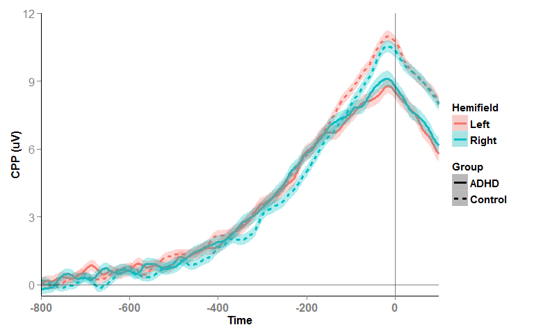 


###So there is no differences in response-locked CPP slope between ADHD and Controls 


#Participant level N2_latency analysis
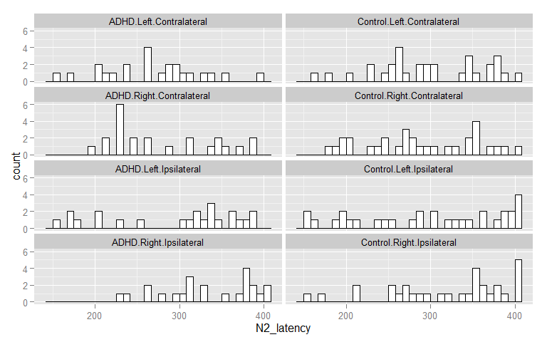 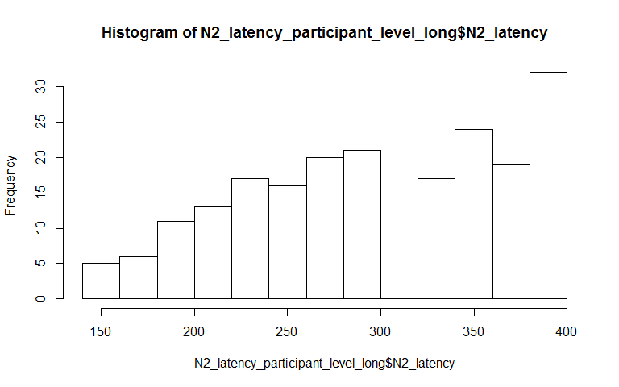 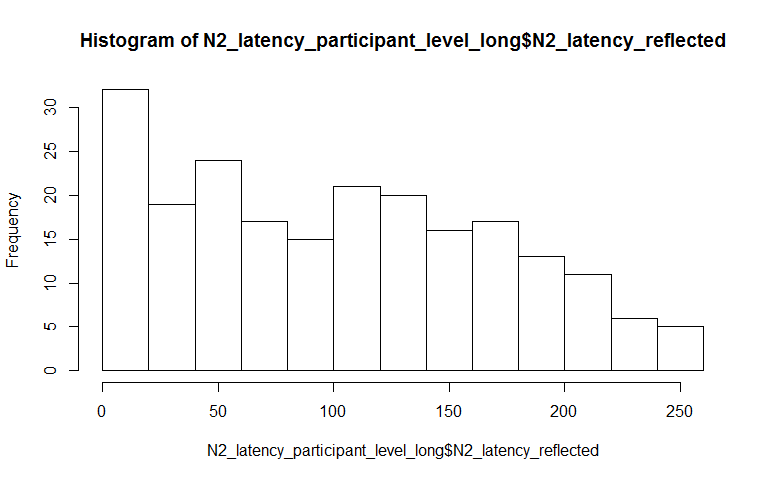 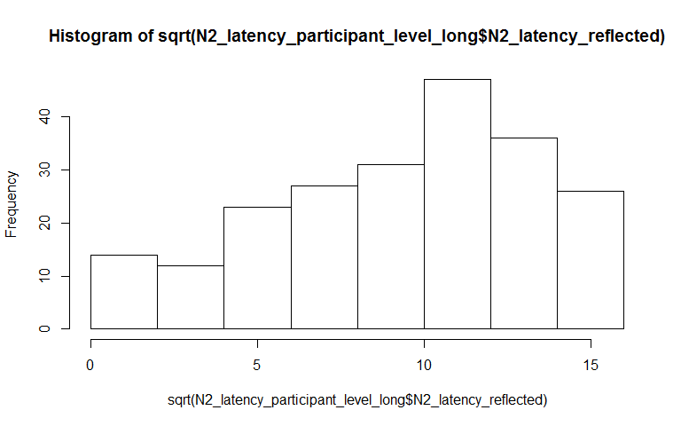 

###Can't account for the skew in N2_latency data. Therefore do a factorial permutation test:


```r
#Show results of factorial permutation test
N2_latency_Perm
```

```
##                       Effect     p p<.05
## 1                      Group 0.536      
## 2                  Hemifield 0.097      
## 3                 Hemisphere 0.213      
## 4            Group:Hemifield 0.001     *
## 5           Group:Hemisphere 0.117      
## 6       Hemifield:Hemisphere 0.119      
## 7 Group:Hemifield:Hemisphere 0.903
```

```r
# #Plot the full design using permutated means and confidence intervals
# ezPlot2(boot, x=Hemisphere, split=Hemifield, col=Group)

#Plot the significant interaction using permutated means and confidence intervals
ezPlot2(boot, x=Hemifield, split=Group)
```

 

###So this ^ is a little weird, ADHD have earlier N2c peak latency for left hemifield targets than controls, even though ADHD have slower left hemifield RTs than controls 


#Go back and check RT data for Time-on-task (TOT) effects
    
    
    ```
    ## Data: data2
    ## Models:
    ## RT_HemifieldbyGroup: log(RT) ~ (1 | ID) + (1 | ITI) + (1 | Hemifield) + (1 | Trial) + 
    ## RT_HemifieldbyGroup:     Group + Hemifield + Group:Hemifield
    ## RT_TOT: log(RT) ~ (1 | ID) + (1 | ITI) + (1 | Hemifield) + (1 | Trial) + 
    ## RT_TOT:     Group + Hemifield + Trial
    ## RT_HemifieldbyTOT: log(RT) ~ (1 | ID) + (1 | ITI) + (1 | Hemifield) + (1 | Trial) + 
    ## RT_HemifieldbyTOT:     Group + Hemifield + Trial + Hemifield:Trial
    ## RT_GroupbyTOT: log(RT) ~ (1 | ID) + (1 | ITI) + (1 | Hemifield) + (1 | Trial) + 
    ## RT_GroupbyTOT:     Group + Hemifield + Trial + Hemifield:Trial + Group:Trial
    ## RT_HemifieldbyGroupbyTOT: log(RT) ~ (1 | ID) + (1 | ITI) + (1 | Hemifield) + (1 | Trial) + 
    ## RT_HemifieldbyGroupbyTOT:     Group + Hemifield + Trial + Hemifield:Trial + Group:Trial + 
    ## RT_HemifieldbyGroupbyTOT:     Group:Hemifield:Trial
    ##                          Df    AIC    BIC  logLik deviance   Chisq Chi Df
    ## RT_HemifieldbyGroup       9 1371.8 1435.7 -676.92   1353.8               
    ## RT_TOT                    9 1375.0 1438.8 -678.48   1357.0  0.0000      0
    ## RT_HemifieldbyTOT        10 1376.1 1447.0 -678.03   1356.1  0.8951      1
    ## RT_GroupbyTOT            11 1364.8 1442.9 -671.40   1342.8 13.2743      1
    ## RT_HemifieldbyGroupbyTOT 12 1362.5 1447.6 -669.23   1338.5  4.3249      1
    ##                          Pr(>Chisq)    
    ## RT_HemifieldbyGroup                    
    ## RT_TOT                    1.0000000    
    ## RT_HemifieldbyTOT         0.3440857    
    ## RT_GroupbyTOT             0.0002691 ***
    ## RT_HemifieldbyGroupbyTOT  0.0375580 *  
    ## ---
    ## Signif. codes:  0 '***' 0.001 '**' 0.01 '*' 0.05 '.' 0.1 ' ' 1
    ```


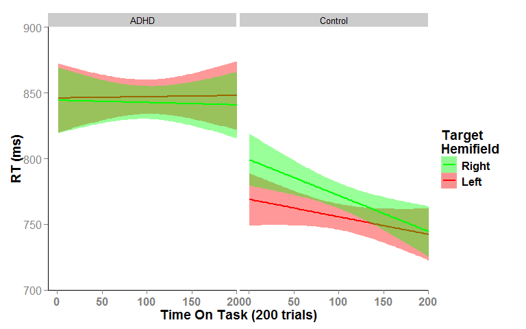 

###Break down the signifiant TOT by Hemifield by group interaction in the RT data:


```r
#########Break down the signifiant TOT by Hemifield by group interaction:
data2$TwoBins<-cut(data2$Trial, c(0,100,220), labels = c("First_Half", "Second_Half"))
summary(data2$TwoBins)
```

```
##  First_Half Second_Half 
##        4433        4496
```

```r
### For Controls, effect of target hemifield during the first half of the session:
summary(glht(lmer(log(RT) ~ Hemifield + (1 | ID) +(1|ITI) + (1|Hemifield) + (1|Trial), data = data2[data2$Group=="Control" & data2$TwoBins=="First_Half",], REML=FALSE, na.action = na.omit)))
```

```
## 
## 	 Simultaneous Tests for General Linear Hypotheses
## 
## Fit: lmer(formula = log(RT) ~ Hemifield + (1 | ID) + (1 | ITI) + (1 | 
##     Hemifield) + (1 | Trial), data = data2[data2$Group == "Control" & 
##     data2$TwoBins == "First_Half", ], REML = FALSE, na.action = na.omit)
## 
## Linear Hypotheses:
##                     Estimate Std. Error z value Pr(>|z|)    
## (Intercept) == 0     6.60031    0.05231 126.183  < 1e-10 ***
## HemifieldRight == 0  0.03116    0.01029   3.027  0.00493 ** 
## ---
## Signif. codes:  0 '***' 0.001 '**' 0.01 '*' 0.05 '.' 0.1 ' ' 1
## (Adjusted p values reported -- single-step method)
```

```r
### For Controls, effect of target hemifield during the 2nd half of the session:
summary(glht(lmer(log(RT) ~ Hemifield + (1 | ID) +(1|ITI) + (1|Hemifield) + (1|Trial), data = data2[data2$Group=="Control" & data2$TwoBins=="Second_Half",], REML=FALSE, na.action = na.omit)))
```

```
## 
## 	 Simultaneous Tests for General Linear Hypotheses
## 
## Fit: lmer(formula = log(RT) ~ Hemifield + (1 | ID) + (1 | ITI) + (1 | 
##     Hemifield) + (1 | Trial), data = data2[data2$Group == "Control" & 
##     data2$TwoBins == "Second_Half", ], REML = FALSE, na.action = na.omit)
## 
## Linear Hypotheses:
##                     Estimate Std. Error z value Pr(>|z|)    
## (Intercept) == 0    6.574021   0.055824 117.763   <1e-10 ***
## HemifieldRight == 0 0.016803   0.009353   1.796    0.139    
## ---
## Signif. codes:  0 '***' 0.001 '**' 0.01 '*' 0.05 '.' 0.1 ' ' 1
## (Adjusted p values reported -- single-step method)
```

```r
### For ADHD, effect of target hemifield during the first half of the session:
summary(glht(lmer(log(RT) ~ Hemifield + (1 | ID) +(1|ITI) + (1|Hemifield) + (1|Trial), data = data2[data2$Group=="ADHD" & data2$TwoBins=="First_Half",], REML=FALSE, na.action = na.omit)))
```

```
## 
## 	 Simultaneous Tests for General Linear Hypotheses
## 
## Fit: lmer(formula = log(RT) ~ Hemifield + (1 | ID) + (1 | ITI) + (1 | 
##     Hemifield) + (1 | Trial), data = data2[data2$Group == "ADHD" & 
##     data2$TwoBins == "First_Half", ], REML = FALSE, na.action = na.omit)
## 
## Linear Hypotheses:
##                      Estimate Std. Error z value Pr(>|z|)    
## (Intercept) == 0    6.7013370  0.0434840 154.110   <1e-10 ***
## HemifieldRight == 0 0.0002265  0.0128765   0.018        1    
## ---
## Signif. codes:  0 '***' 0.001 '**' 0.01 '*' 0.05 '.' 0.1 ' ' 1
## (Adjusted p values reported -- single-step method)
```

```r
### For ADHD, effect of target hemifield during the 2nd half of the session:
summary(glht(lmer(log(RT) ~ Hemifield + (1 | ID) +(1|ITI) + (1|Hemifield) + (1|Trial), data = data2[data2$Group=="ADHD" & data2$TwoBins=="Second_Half",], REML=FALSE, na.action = na.omit)))
```

```
## 
## 	 Simultaneous Tests for General Linear Hypotheses
## 
## Fit: lmer(formula = log(RT) ~ Hemifield + (1 | ID) + (1 | ITI) + (1 | 
##     Hemifield) + (1 | Trial), data = data2[data2$Group == "ADHD" & 
##     data2$TwoBins == "Second_Half", ], REML = FALSE, na.action = na.omit)
## 
## Linear Hypotheses:
##                     Estimate Std. Error z value Pr(>|z|)    
## (Intercept) == 0     6.70420    0.05034 133.174   <1e-10 ***
## HemifieldRight == 0 -0.01124    0.01259  -0.893    0.604    
## ---
## Signif. codes:  0 '***' 0.001 '**' 0.01 '*' 0.05 '.' 0.1 ' ' 1
## (Adjusted p values reported -- single-step method)
```

 

###So this ^ shows that during the start of the task, Controls had significant pseudoneglect (left hemifield RT bias) which shifted rightward over time to no bias by the end of the task. ADHD on the other hand, had no bias at the start of the task, and showed a small (non-significant) rightward shift over time-on-task


#Look at Pre-target alpha-power over time-on-task


```
## Number of Observations for modle:
```

```
## [1] 16813
```

```
## Data: DF
## Models:
## PreAlphaPower_random_intercepts_only: log(PreAlphaPower) ~ 1 + (1 | ID/Hemisphere) + (1 | ITI) + (1 | 
## PreAlphaPower_random_intercepts_only:     Trial)
## PreAlphaPower_Group: log(PreAlphaPower) ~ (1 | ID/Hemisphere) + (1 | ITI) + (1 | Trial) + 
## PreAlphaPower_Group:     Group
## PreAlphaPower_Hemisphere: log(PreAlphaPower) ~ (1 | ID/Hemisphere) + (1 | ITI) + (1 | Trial) + 
## PreAlphaPower_Hemisphere:     Group + Hemisphere
## PreAlphaPower_GroupbyHemisphere: log(PreAlphaPower) ~ (1 | ID/Hemisphere) + (1 | ITI) + (1 | Trial) + 
## PreAlphaPower_GroupbyHemisphere:     Group + Hemisphere + Group:Hemisphere
## PreAlphaPower_TOT: log(PreAlphaPower) ~ (1 | ID/Hemisphere) + (1 | ITI) + (1 | Trial) + 
## PreAlphaPower_TOT:     Group + Hemisphere + Trial + Group:Hemisphere
## PreAlphaPower_GroupbyTOT: log(PreAlphaPower) ~ (1 | ID/Hemisphere) + (1 | ITI) + (1 | Trial) + 
## PreAlphaPower_GroupbyTOT:     Group + Hemisphere + Trial + Group:Hemisphere + Group:Trial
## PreAlphaPower_HemispherebyTOT: log(PreAlphaPower) ~ (1 | ID/Hemisphere) + (1 | ITI) + (1 | Trial) + 
## PreAlphaPower_HemispherebyTOT:     Group + Hemisphere + Trial + Group:Hemisphere + Group:Trial + 
## PreAlphaPower_HemispherebyTOT:     Hemisphere:Trial
## PreAlphaPower_GroupbyHemispherebyTOT: log(PreAlphaPower) ~ (1 | ID/Hemisphere) + (1 | ITI) + (1 | Trial) + 
## PreAlphaPower_GroupbyHemispherebyTOT:     Group + Hemisphere + Trial + Group:Hemisphere + Group:Trial + 
## PreAlphaPower_GroupbyHemispherebyTOT:     Hemisphere:Trial + Group:Hemisphere:Trial
##                                      Df   AIC   BIC  logLik deviance
## PreAlphaPower_random_intercepts_only  6 16243 16290 -8115.7    16231
## PreAlphaPower_Group                   7 16245 16299 -8115.6    16231
## PreAlphaPower_Hemisphere              8 16243 16305 -8113.4    16227
## PreAlphaPower_GroupbyHemisphere       9 16245 16314 -8113.4    16227
## PreAlphaPower_TOT                    10 16190 16268 -8085.2    16170
## PreAlphaPower_GroupbyTOT             11 16187 16272 -8082.7    16165
## PreAlphaPower_HemispherebyTOT        12 16189 16281 -8082.3    16165
## PreAlphaPower_GroupbyHemispherebyTOT 13 16187 16287 -8080.3    16161
##                                        Chisq Chi Df Pr(>Chisq)    
## PreAlphaPower_random_intercepts_only                              
## PreAlphaPower_Group                   0.1959      1    0.65808    
## PreAlphaPower_Hemisphere              4.3971      1    0.03600 *  
## PreAlphaPower_GroupbyHemisphere       0.0196      1    0.88875    
## PreAlphaPower_TOT                    56.2520      1  6.375e-14 ***
## PreAlphaPower_GroupbyTOT              5.0900      1    0.02406 *  
## PreAlphaPower_HemispherebyTOT         0.6781      1    0.41025    
## PreAlphaPower_GroupbyHemispherebyTOT  4.0752      1    0.04352 *  
## ---
## Signif. codes:  0 '***' 0.001 '**' 0.01 '*' 0.05 '.' 0.1 ' ' 1
```

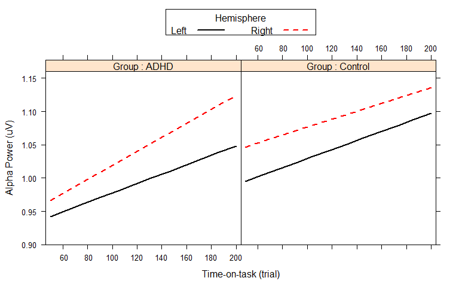 

**This plot ^ shows ADHD have a rightward shift in hemispheric alpha asymmetry with TOT, driven by increasing right hemisphere alpha power over time**


###Break down the sinigicant Group by Hemisphere by TOT interaction in pre-target alpha power:

```
## Data: [
## Data: DF
## Data: DF$Group == "Control"
## Data: 
## Models:
## PreAlphaPower_random_intercepts_only_Control: log(PreAlphaPower) ~ 1 + (1 | ID/Hemisphere) + (1 | ITI) + (1 | 
## PreAlphaPower_random_intercepts_only_Control:     Trial)
## PreAlphaPower_Hemisphere_Control: log(PreAlphaPower) ~ (1 | ID/Hemisphere) + (1 | ITI) + (1 | Trial) + 
## PreAlphaPower_Hemisphere_Control:     Hemisphere
## PreAlphaPower_TOT_Control: log(PreAlphaPower) ~ (1 | ID/Hemisphere) + (1 | ITI) + (1 | Trial) + 
## PreAlphaPower_TOT_Control:     Hemisphere + Trial
## PreAlphaPower_HemispherebyTOT_Control: log(PreAlphaPower) ~ (1 | ID/Hemisphere) + (1 | ITI) + (1 | Trial) + 
## PreAlphaPower_HemispherebyTOT_Control:     Hemisphere + Trial + Hemisphere:Trial
##                                              Df    AIC    BIC  logLik
## PreAlphaPower_random_intercepts_only_Control  6 9702.0 9745.3 -4845.0
## PreAlphaPower_Hemisphere_Control              7 9700.7 9751.3 -4843.3
## PreAlphaPower_TOT_Control                     8 9669.7 9727.5 -4826.8
## PreAlphaPower_HemispherebyTOT_Control         9 9671.3 9736.4 -4826.7
##                                              deviance   Chisq Chi Df
## PreAlphaPower_random_intercepts_only_Control   9690.0               
## PreAlphaPower_Hemisphere_Control               9686.7  3.2677      1
## PreAlphaPower_TOT_Control                      9653.7 33.0094      1
## PreAlphaPower_HemispherebyTOT_Control          9653.3  0.3842      1
##                                              Pr(>Chisq)    
## PreAlphaPower_random_intercepts_only_Control               
## PreAlphaPower_Hemisphere_Control                0.07066 .  
## PreAlphaPower_TOT_Control                     9.171e-09 ***
## PreAlphaPower_HemispherebyTOT_Control           0.53538    
## ---
## Signif. codes:  0 '***' 0.001 '**' 0.01 '*' 0.05 '.' 0.1 ' ' 1
```

```
## Data: [
## Data: DF
## Data: DF$Group == "ADHD"
## Data: 
## Models:
## PreAlphaPower_random_intercepts_only_ADHD: log(PreAlphaPower) ~ 1 + (1 | ID/Hemisphere) + (1 | ITI) + (1 | 
## PreAlphaPower_random_intercepts_only_ADHD:     Trial)
## PreAlphaPower_Hemisphere_ADHD: log(PreAlphaPower) ~ (1 | ID/Hemisphere) + (1 | ITI) + (1 | Trial) + 
## PreAlphaPower_Hemisphere_ADHD:     Hemisphere
## PreAlphaPower_TOT_ADHD: log(PreAlphaPower) ~ (1 | ID/Hemisphere) + (1 | ITI) + (1 | Trial) + 
## PreAlphaPower_TOT_ADHD:     Hemisphere + Trial
## PreAlphaPower_HemispherebyTOT_ADHD: log(PreAlphaPower) ~ (1 | ID/Hemisphere) + (1 | ITI) + (1 | Trial) + 
## PreAlphaPower_HemispherebyTOT_ADHD:     Hemisphere + Trial + Hemisphere:Trial
##                                           Df    AIC    BIC  logLik
## PreAlphaPower_random_intercepts_only_ADHD  6 6587.1 6627.9 -3287.5
## PreAlphaPower_Hemisphere_ADHD              7 6587.7 6635.3 -3286.9
## PreAlphaPower_TOT_ADHD                     8 6539.9 6594.2 -3261.9
## PreAlphaPower_HemispherebyTOT_ADHD         9 6537.6 6598.7 -3259.8
##                                           deviance   Chisq Chi Df
## PreAlphaPower_random_intercepts_only_ADHD   6575.1               
## PreAlphaPower_Hemisphere_ADHD               6573.7  1.3485      1
## PreAlphaPower_TOT_ADHD                      6523.9 49.8645      1
## PreAlphaPower_HemispherebyTOT_ADHD          6519.6  4.3026      1
##                                           Pr(>Chisq)    
## PreAlphaPower_random_intercepts_only_ADHD               
## PreAlphaPower_Hemisphere_ADHD                0.24554    
## PreAlphaPower_TOT_ADHD                     1.647e-12 ***
## PreAlphaPower_HemispherebyTOT_ADHD           0.03805 *  
## ---
## Signif. codes:  0 '***' 0.001 '**' 0.01 '*' 0.05 '.' 0.1 ' ' 1
```

###SO, only ADHD have a significant Hemisphere*TOT effect:

```
## 
## 	 Simultaneous Tests for General Linear Hypotheses
## 
## Fit: lmer(formula = log(PreAlphaPower) ~ (1 | ID/Hemisphere) + (1 | 
##     ITI) + (1 | Trial) + Hemisphere + Trial + Hemisphere:Trial, 
##     data = DF[DF$Group == "ADHD", ], REML = F, na.action = na.omit)
## 
## Linear Hypotheses:
##                                                 Estimate Std. Error
## LeftHemisphere:TOT vs RightHemisphere:TOT == 0 0.0003448  0.0001662
##                                                z value Pr(>|z|)  
## LeftHemisphere:TOT vs RightHemisphere:TOT == 0   2.075    0.038 *
## ---
## Signif. codes:  0 '***' 0.001 '**' 0.01 '*' 0.05 '.' 0.1 ' ' 1
## (Adjusted p values reported -- single-step method)
```

```
## 
## 	 Simultaneous Tests for General Linear Hypotheses
## 
## Fit: lmer(formula = log(PreAlphaPower) ~ (1 | ID/Hemisphere) + (1 | 
##     ITI) + (1 | Trial) + Hemisphere + Trial + Hemisphere:Trial, 
##     data = DF[DF$Group == "Control", ], REML = F, na.action = na.omit)
## 
## Linear Hypotheses:
##                                                  Estimate Std. Error
## LeftHemisphere:TOT vs RightHemisphere:TOT == 0 -8.134e-05  1.312e-04
##                                                z value Pr(>|z|)
## LeftHemisphere:TOT vs RightHemisphere:TOT == 0   -0.62    0.535
## (Adjusted p values reported -- single-step method)
```


###Plot Alpha Asymmetry Index by TOT and Group help look at significant Group x Hemisphere x TOT interaction in the alpha power data

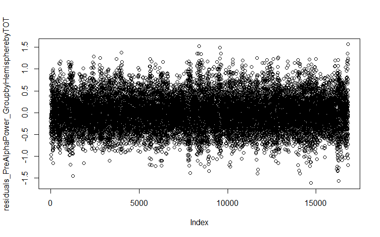 


**So ADHD have a significant rightward shift in hemispheric alpha asymmetry with TOT, while ADHD do not. Above shows ADHD's rightward shift is driven by increasing right hemisphere alpha power over time**


#####################################################################################################################################################################
#####################################################################################################################################################################
#####################################################################################################################################################################
#####################################################################################################################################################################
#####################################################################################################################################################################
#####################################################################################################################################################################
#####################################################################################################################################################################
#####################################################################################################################################################################
#####################################################################################################################################################################
#####################################################################################################################################################################
#####################################################################################################################################################################
#####################################################################################################################################################################
############################################################################################################
############################################################################################################
############################################################################################################
############################################################################################################
############################################################################################################
############################################################################################################
############################################################################################################
############################################################################################################
############################################################################################################
############################################################################################################
############################################################################################################
############################################################################################################
############################################################################################################
############################################################################################################


#Test how clinical measures relate to Asymmetry Indices and other variables of interest: 


```
## The following `from` values were not present in `x`: Group.x
## Loading required package: Hmisc
## Loading required package: Formula
## 
## Attaching package: 'Hmisc'
## 
## The following objects are masked from 'package:plyr':
## 
##     is.discrete, summarize
## 
## The following object is masked from 'package:psych':
## 
##     describe
## 
## The following objects are masked from 'package:base':
## 
##     format.pval, round.POSIXt, trunc.POSIXt, units
```

```
## [1] 0.2787106
```

###Plot correlation heatmap of some variables of interest, keeping only those relationships with uncorrected p<.05

**NOTE: for the N2c/i the "_PA" or "_GA" represents whether the N2 measurement window was based on peak amplitude of individual participant's wavefore, or the Grand Average Waveform. ** 
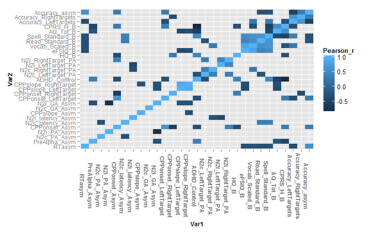 

**Try same thing but plotting absolute r value (from 0 to 1; instead of from -1 to 1 as in the plot above)**
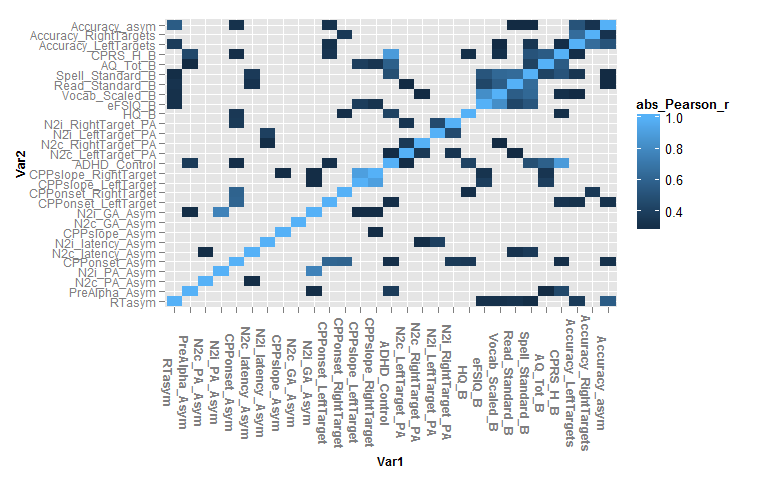 


